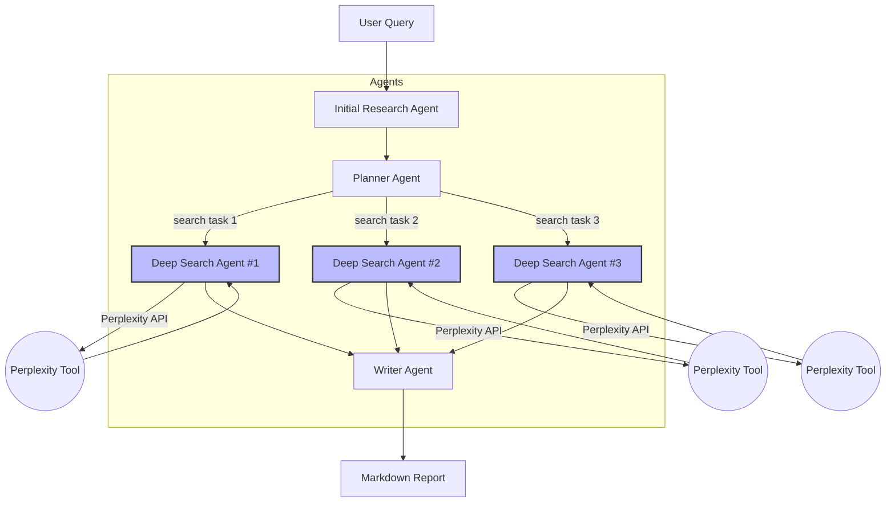

# DeepResearchSDK

DeepResearchSDK is an **OpenAI Agent SDK**–based framework for running in-depth research pipelines powered by a team of cooperating AI agents.

The framework automates the whole research workflow—from the very first web scan to the delivery of a polished markdown report—while remaining production-ready and easy to extend.

## Architecture



### Component rundown

| Component | Role |
|-----------|------|
| **Initial Research Agent** | Performs a quick, low-cost scan to obtain a first snapshot of the topic. |
| **Planner Agent** | Analyses the snapshot and produces a list of focused search tasks. |
| **Deep Search Agents** | A pool of agents (spawned in parallel) that execute the search tasks via Perplexity's web-search API. |
| **Writer Agent** | Consolidates all search results and crafts a coherent, well-structured markdown report. |

## Key features

* ⚡ **Parallel execution** – deep search tasks run concurrently for maximum throughput.
* 🔍 **Perplexity integration** – every search agent calls the Perplexity API for up-to-date information.
* 💡 **Agent orchestration** – a clear separation of concerns handled by `ResearchManager`.
* 📝 **Automated report writing** – produces polished markdown ready for publishing.
* 📈 **Tracing hooks** – built-in OpenAI trace IDs for debugging and audit.
* 🚀 **Production-ready** – the code in `deep_research/` is ready to deploy; the Jupyter notebook is for exploration only.

## Running a research session

```bash
# powered by the ultra-fast Python package manager "uv"
uv run deep_research.py
```

or programmatically:

```python
import asyncio
from deep_research import ResearchManager

async def main():
    manager = ResearchManager()
    async for update in manager.run("Analyse the company Broxus"):
        print(update)

asyncio.run(main())
```

## Project layout

```
deep_research/
├── deep_research.py          # entry-point convenience script
├── research_manager.py       # orchestrator
├── initial_research_agent.py # initial scan agent
├── planner_agent.py          # planner agent
├── deep_researcher_agent.py  # deep search agent template
├── writer_agent.py           # writer agent
├── requirements.txt          # pip dependencies
research.ipynb                # notebook for tutorials & experiments
```

## Requirements

* Python 3.7+
* See `requirements.txt` for exact package versions.

## License

MIT